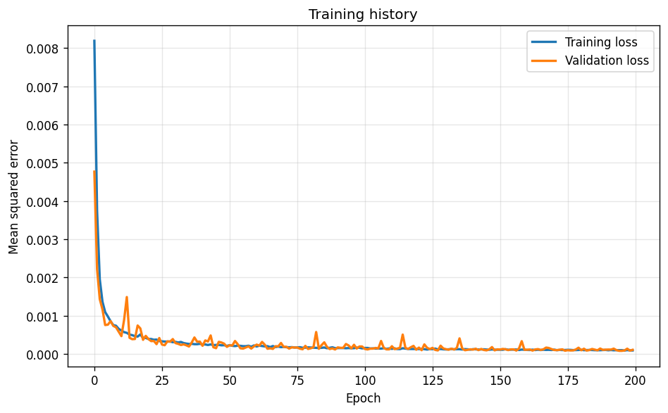
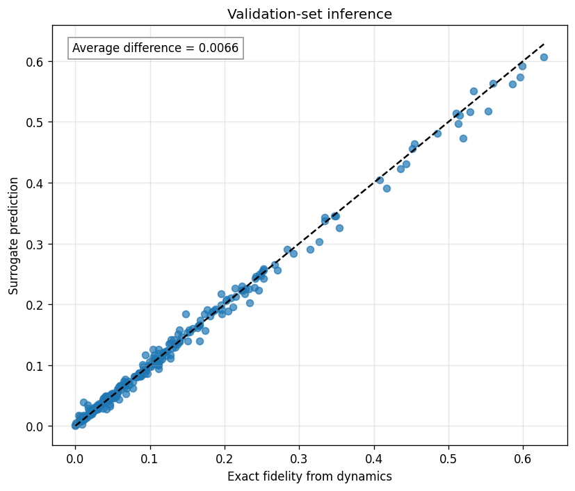
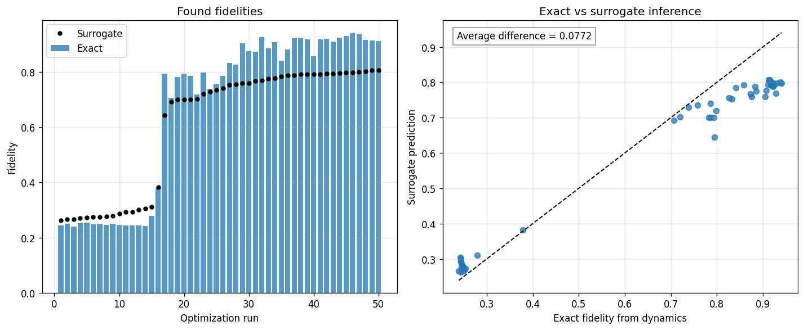

# Optimization of Fock-State Preparation in a Hybrid Quantum System using a Neural-Network Surrogate Model

This repository showcases a research-oriented machine-learning project at the intersection of quantum dynamics, numerical simulation, and gradient-based optimization.

The central idea is to replace repeated expensive simulations with a neural-network surrogate model. This model approximates the figure of merit and allows much faster optimization by applying gradient descent directly to the surrogate.

## Highlights

- **Problem:** exact quantum-dynamics evaluations are computationally expensive during parameter optimization.
- **Method:** a dense neural network is trained on precomputed simulation data and then used as a differentiable surrogate for pulse optimization.
- **Outcome:** the stored results show an average exact-surrogate validation difference of about $0.0066$ and optimized exact fidelities up to about $0.94$.
- **Stack:** Python, NumPy, TensorFlow/Keras, Matplotlib, scikit-learn, and pytest.

## Why this matters

For larger pulse sequences and more complex control problems, brute-force or repeated exact simulation quickly becomes the bottleneck. This project demonstrates how surrogate modeling can preserve useful physical accuracy while making optimization much more practical.

For a more detailed description of the physics and the surrogate-model setup, see [docs/physics_and_approach.md](docs/physics_and_approach.md).


## Workflow overview

The workflow is intentionally compact and research-oriented:

1. Train a dense neural network to approximate the target-state fidelity.
2. Use the trained surrogate as a fast differentiable optimizer for the control parameters.
3. Validate the optimized parameters with the exact benchmark dynamics.


## Key findings

The current experiments show that the chosen architecture learns the fidelity landscape induced by the exact dynamics very well. The stored validation metrics indicate an average exact-surrogate difference of about $0.0066$.

In the present training pipeline, samples above a fidelity threshold of $0.7$ are excluded so that the model focuses on the harder low- and medium-fidelity region. Despite that restriction, the stored example optimization results still reach exact fidelities of about $0.94$, which is encouraging for more complex pulse sequences.

This also suggests that even though inference becomes worse when high-fidelity solutions are omitted from the training data, the surrogate approach can identify highest-fidelity pulse configurations.

## Repository structure

### [Dynamics_with_unitary_operators.py](Dynamics_with_unitary_operators.py)
This script contains the exact physics-based benchmark model.

It:
- builds the operator matrices,
- defines the Hamiltonians,
- computes the unitary dynamics of the three-pulse sequence,
- evaluates the target-state probability for a given parameter set.

### [Training.py](Training.py)
This script trains the surrogate neural network.

It:
- loads the compact fidelity dataset,
- randomly samples up to $200000$ training examples,
- removes the fixed phase entries to obtain the five effective NN inputs,
- trains a dense neural network to approximate the physical benchmark,
- validates the predictions against the exact model and saves the trained surrogate.

### [Surrogate_Model_GD.py](Surrogate_Model_GD.py)
This script performs optimization using the trained surrogate model.

It:
- loads the trained network,
- computes gradients of the model output with respect to the input parameters,
- performs multiple Adam-based optimization runs from random initial points,
- validates the optimized parameters against the exact dynamical model,
- visualizes the comparison between neural-network predictions and true physical values.

## Data and artifacts

- [data/Three_Pulse_Dynamics_Data.npy](data/Three_Pulse_Dynamics_Data.npy): full benchmark dataset containing pulse parameters and state-vector output
- [data/Three_Pulse_Fidelity_Data.npy](data/Three_Pulse_Fidelity_Data.npy): compact dataset containing pulse parameters and one precomputed fidelity per sample
- [data/random_init_params.npy](data/random_init_params.npy): random initializations for optimization runs
- trained model artifacts are created during training and reused for surrogate-based optimization

## Quickstart

Install the required packages with:

```bash
pip install -r requirements.txt
```

Typical workflow:

1. Generate or provide the dynamics dataset.
2. Train the surrogate model with [Training.py](Training.py).
3. Run surrogate-based optimization with [Surrogate_Model_GD.py](Surrogate_Model_GD.py).
4. Compare neural-network predictions against the exact benchmark.
5. Run the test suite with `pytest -q`.

## Example results

The repository also contains example output figures produced during training and surrogate-guided optimization.

### Training history



### Validation: exact vs. surrogate



### Surrogate-guided optimization outcome



## Motivation and outlook

This project is intended as a compact demonstration of how machine learning can support quantum-control problems in hybrid quantum systems. Even in the reduced three-pulse setting, the surrogate model captures the benchmark faithfully and can guide the search toward near-unity fidelities.

A natural next step would be to extend the framework to more demanding pulse structures, such as four-pulse protocols or longer sequences, and to include dissipative effects or loss. Those are precisely the scenarios in which surrogate-based optimization becomes most attractive, since the cost of repeated exact simulations grows quickly.

## Notes

The code is intentionally kept close to the original research workflow. The focus of the repository is on clarity, physical interpretability, and demonstrating how simulation and machine learning can be combined in a compact but technically meaningful project.
